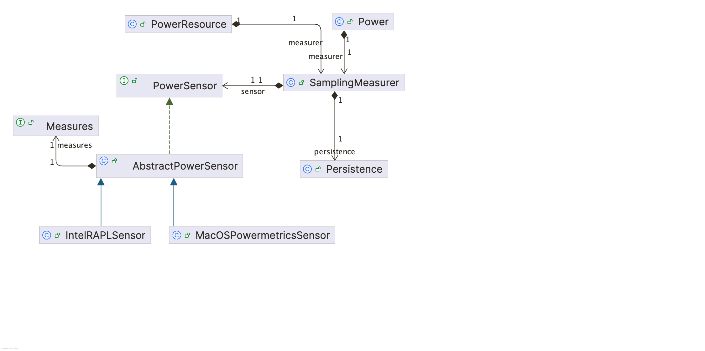
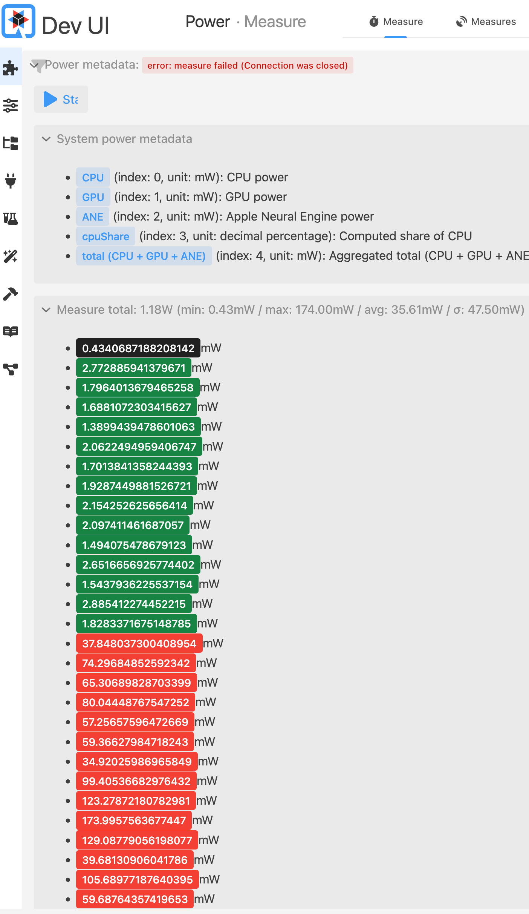
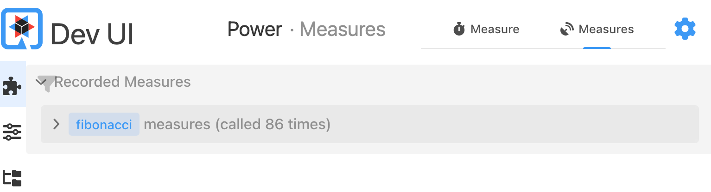

= Measuring software power consumption: challenges & perspectives
Christophe Laprun <claprun@ibm.com>

== A warming world

Green-house gases (GHG), emitted by our industrial processes and everyday energy requirements, keep accumulating in our atmosphere, trapping heat from the sun, gradually warming our world. The evolution of global temperatures is quite unequivocal: our world is warming up at quite a frightening pace.

.Evolution of global temperatures from 1850 to 2025
[#img-global-temp-change,link=https://showyourstripes.info/c/globe]
image::global-temp-change.png[Evolution of global temperatures 1850 - 2025]

Successive Conference of the Parties (the famous COPs) have tried to address the issue since 1995 with the Kyoto protocol and the Paris agreement to try and limit the global warming to below 1.5ºC compared to pre-industrial levels in order to mitigate potentially dramatic consequences. While there is encouraging progress, GHG emissions must still be curbed if we wish to respect the Paris agreement: the remaining budget to stay under 1.5ºC increase in temperature is 170 GtCO2, equivalent to 4 years at the 2025 emissions level, according to the https://globalcarbonbudget.org/[Global Carbon Project].

.Global fossil CO2 emissions since 1990
[#img-emissions,link=https://robbieandrew.github.io/GCB2025/]
image::emissions.png[Global fossil CO2 emissions since 1990]

== The impact of Information & Communication Technologies (ICT)

[quote,GreenIT's 2025 Environmental footprint of the digital world report]
In 2023, global digital technology accounts for 3.4% of global GHG emissions.

Contrary to what the term "dematerialization” evokes, digital technology is very material. Significant amounts of resources are used up both to produce and run the necessary equipment. Estimates put the global impact of ICT at 3.4% of global GHG emissions, or about 5.5 times those of France, per https://greenit.eco/wp-content/uploads/2025/05/greenit-world-study-2025-20250417.pdf[GreenIT's 2025 3rd Environmental footprint of the digital world report]. Generative artificial intelligence already accounts for over 4% of these emissions and its share is increasing sharply. It's also worth noting that, while we focus here on energy consumption, the impact of ICT is felt far and wide at different levels: water usage, local temperature increases, metals and minerals consumption, noise, health impacts, human exploitation, conflicts, etc.

Companies in the ICT field therefore have a major role to play to ensure that our planet stays within the allowable carbon budget (or, at least, as close as possible) to meet the Paris agreement goals. Any GHG emission that can be avoided by ICT companies will help. From that perspective, the biggest lever a company can activate to reduce its emissions relies on careful consideration of what's actually needed and useful: indeed, for this purpose, the best GHG emission is the one that doesn't exist in the first place. If a piece of software doesn't need to run, then it probably shouldn't run. Designing confidence-inspiring architecture and processes (such as continuous deployment) enabling easy scaling up and down (even to zero) of services can have tremendous impacts on avoiding potential GHG emissions. Similarly, reducing the need for hardware renewal by making sure that software runs efficiently on existing hardware is also important because a significant amount of emissions comes from hardware renewals. Once that's accomplished, what remains is supposedly emissions that cannot be avoided and are targets for potential reduction.

== Measure to act

[quote,William Edwards Demming]
Without data, you're just another person with an opinion.

Once avoidable emissions are indeed avoided, ICT companies are left with the arduous task of measuring and reducing what remains. Indeed, in order to alleviate said emissions, companies first need to be able to understand where they're coming from but, also, and maybe more importantly, measure them. Without measures, it would be quite difficult to assess progress or if developments are trending in the right direction.

What do we need to measure, though? Obviously, there is no way to directly measure how many GHG are emitted to run an application. For that matter, what do we need to take into account? Should we take into account the emissions associated with producing the hardware that runs the application? Should we impart some portion of the emissions that went into building the data centers where our application run? We initially decided to focus on attempting to measure the emissions incurred by running the application *only*, i.e. how many GHG got emitted to power our application. We've also decided to focus on measuring each component of the application individually. As we shall see later, this isn't as easily achieved as one might think. Moving from components to the application as a whole becomes significantly more complex, especially for distributed applications, and we need the components' contribution before being able to assess the whole's.

=== A developer-focused approach

Another question that needed to be addressed was, when, during the software lifecycle, should we measure? We've taken a https://en.wikipedia.org/wiki/Shift-left_testing["Shift Left"] approach because we believe that the later in a product's lifecycle, the more costly it is to change. This approach is also consistent with the https://en.wikipedia.org/wiki/DevOps[DevOps philosophy] where developers are involved with the operational aspects of the application they work on. The choices made during the application's design therefore shape its energy intensity and the earlier adaptations are made, the cheaper and easier to make them.

If they are empowered to do so by specific tooling, developers can make power-aware design decisions (algorithm, framework choices, etc.) and balance the tradeoffs of differing solutions with respect to the target goal. This is why we chose to focus on creating developer tooling. This choice also echoes discussions we've had with CTOs wanting to have a better view of their products' sustainability as they were developed.

=== From energy consumption to GHG emissions?

From a developer's perspective, though, emissions are quite a remote target. Indeed, a developer's laptop bears little resemblance to a server blade in a datacenter. For that matter, where the application runs might cause wildly different emissions whether it's run in a datacenter powered by a coal power plant or in a solar-powered one. What remains constant is how *efficient* the application is with the available resources. If we can reduce the energy consumption of our application locally while developing it, it should follow that we should see some form of these reductions when the application is run in production as well. There are, of course, nuances to this statement but from that perspective, energy efficiency is another facet of optimization, with similar associated caveats.

Can we, however, go from measured energy consumption to GHG emissions? The question becomes can we measure the carbon intensity of the energy we consumed? To be able to do so, we would need access to real-time carbon intensity information of the current electricity mix that used to power the application. We could use yearly averages or even daily measures but that information is not available everywhere, and it definitely doesn't have the granularity that would be required to get exact measures at any given time. Quite difficult to obtain for applications running on local hardware, this information is virtually impossible to get when the application is running on servers at large cloud providers. Of note, though, the https://greensoftware.foundation/standards/rtc/[Green Software's Real-Time Energy and Carbon Data for Cloud] aims to address this issue.

For our purpose, we decided to focus solely on energy consumption at this point. We also made the choice of initially focusing on the CPU, instead of trying to track down all power consumption sources. This decision was made to simplify the initial implementation and validate the architecture before attempting to go further. This obviously impacts the reported consumption as not all workloads will be CPU-bound. When information from other sources is available, we do take it into account, though.

== Requirements for a developer-oriented software power-meter

Based on this simplified scope, what would we like in a software power-meter that developers could use while they write the code of their application?

First of all, of course, we need accurate energy / power consumption measures, minimally at the process level so that energy can be imputed at the application level. Ideally, we could get all the way down to the method / function / code block level. We need to ensure statistical relevance so that we can have confidence in the results in a way that can be used to measure progress or lack thereof.

One really important aspect for this work is also platform independence: we have to meet our users where they are and can't expect developers to use a specific OS just because it's more convenient. By the same token, it's not enough to have a system that works: it needs to provide great developer experience because if it's too difficult to deploy, then people will not use it. Similarly, it needs to fit into people's workflow without interrupting it or minimally so. Ideally, it would integrate seamlessly with observability and profiling stacks.

From an implementation perspective, the measuring system needs to be as lightweight as possible since developers already often push their hardware to close to its limit. Moreover, we don't want the observer (the measuring software) to have too much of an impact on the system it's measuring to not influence the measure too much.

Finally, we want to record measures in such a way that we can go back and look at historical data to extrapolate trends and measure progress independently of transient variations. For that purpose, we need to be able to record measures for a given application version but also possibly variations thereof, in case we want to test the impact of different implementations.

There are multiple software power-meters available, and we keep discovering new ones as we keep researching the topic. See, for example, the https://inria.hal.science/hal-04030223/file/_CCGrid23__An_experimental_comparison_of_software_based_power_meters__from_CPU_to_GPU.pdf["An experimental comparison of software-based power meters: focus on CPU and GPU" paper] for a comparison of existing tools. For our purpose, however, when we started this work, there was no tool that fit our needs. We initially considered, and even contributed a macOS backend to, https://github.com/joular/joularjx[JoularJX]. However, we deemed, at the time, the agent approach not suitable for our purpose, since it would run in the same VM process as the monitored application, thus impacting the measure.

== Enter `power-server` and `quarkus-power`

Based on this initial assessment, we set out to implement a system that could fulfill as many of the requirements we identified above as possible. Being Java developers and working on Java platform products, we naturally chose Java for this endeavor, especially considering that the JVM itself is quite energy-efficient, at least according to a https://arxiv.org/abs/2410.05460v1[comparison of the energy efficiency of programming languages]. After exploring in-process options (such as JoularJX), we settled on a server-oriented architecture: the server creates an abstraction layer on top of the hardware and provides a consistent view of the measures. That way, measures could be used in a platform-independent way regardless of the specificity of how the measure is actually performed at the hardware level. Using a server separates the monitoring software from the monitored application, making it easier to measure.

The server publishes metadata about the available platform sensors and streams measures as they come in. The metadata allows client software (i.e. any piece of software interested in the energy consumption measures) to make sense of the streamed data, intentionally kept as minimal as possible to limit the impact. We chose a REST implementation, leveraging established standards, to make it easy for client applications to connect the power measuring server, thus enabling a wide variety of applications, in a language- and framework-agnostic way.

This server part of the architecture is implemented in the https://github.com/metacosm/power-server[`power-server`] project. This is a https://quarkus.io[Quarkus] application that aims to be as efficient as possible, though heavy optimization hasn't taken place at this point as we first focus on ensuring data validity first.

=== Power sensors

From an architecture point of view, the hardware abstraction is realized by an API representing a power sensor. This API is currently implemented for two platforms: Linux and macOS.

==== macOS implementation

On macOS, power monitoring is performed using the bundled
https://developer.apple.com/library/archive/documentation/Performance/Conceptual/power_efficiency_guidelines_osx/PrioritizeWorkAtTheTaskLevel.html#//apple_ref/doc/uid/TP40013929-CH35-SW10[`powermetrics`] tool. This is a rather high-level software, designed mostly for human consumption. As such, it outputs formatted information that needs to be parsed to extract the relevant piece of data. It also runs as a separate process, launched seamlessly from `power-server`. From it, we can get per-application energy consumption, along with overall consumption for the CPU, GPU and Apple's Neural Engine (Apple's AI-focused chip). This works in a similar fashion on both Intel and Apple Silicon hardware.

==== Linux implementation

On Linux, we leverage Intel's RAPL technology via the https://www.kernel.org/doc/html/latest/power/powercap/powercap.html[`powercap`] framework.
In particular, this requires read access to files located in the `/sys/class/powercap/intel-rapl` directory. The information found there is organized under directories representing a part of the CPU architecture, each containing files representing how many micro-Joules were spent by that particular component since the counter was last reset. From these counters, we compute power consumption. As the name implies, this API is only available for x86 architectures, so supporting ARM-based CPUs would require a different implementation. There is no information on the potential consumption of other components such as external GPU, which would require accessing a different API. Moreover, the data thus gathered is provided at the system level, not the application one. Some work is therefore required to figure out which proportion of that consumption can actually be imputed to a specific application.

=== Sampler

Each platform "sensor" implementation reports the data in the same format, along with associated metadata as detailed above. However, some coordination work is still required. This is the role of the sampling mechanism (henceforth referred to as sampler) that controls how often the sensors are probed and takes care of computing energy measures based on the sensor data and metadata. Moreover, since some implementations do not attribute the share of the global power consumption to specific processes, the sampler also maintains a parallel sampling of the CPU share for each process of interest. More specifically, the sampler takes care of merging the two data streams (power measures, CPU usage) into a coherent stream if required so that power consumption can be properly imputed to processes under observation.

To measure an application's power consumption, one would thus request the sampler to start monitoring a given set of processes, starting the power sensors or CPU usage sampler as required. The measures are then recorded in an embedded SQLite database using https://github.com/roastedroot/sqlite4j[SQLite4J] using application and session identifiers to satisfy the requirement of being able to compare different runs of the same application. One can also ask the persistence layer to aggregate the data for such a combination of application / session to get an easy measure of the power consumption for a given session. The measure stream can also be pulled by a REST server to republish the data externally.

Below is an overview of the `power-server` architecture: the core component is the `SamplingMeasurer`, which gets a `PowerSensor` instance injected, depending on the underlying platform. The sensor produces a stream of `Measures`, that the sampler exploits and records via the `Persistence` instance (which is configurable but right now only has one implementation as described above). The `SamplingMeasurer` is then driven by `PowerResource`, which implements the REST endpoint or `Power`, which is a Command-Line Interface (CLI) tool that we describe below.

.power-server architecture
[#power-server-architecture]

=== Quarkus extension

One application of this platform-agnostic, power-measuring backend that we had in mind was to provide a https://github.com/metacosm/quarkus-power[`quarkus-power` Quarkus extension] that would help Quarkus application developers to monitor the power consumption of their app as it's being developed. For that purpose, the extension integrates with Quarkus' Dev mode and provide Dev UI components to start, stop and display power measures, as shown below:

.Dev UI component to start and display power measures
[#quarkus-power-control]

As you can see, the UI displays the system metadata from the sensor, along with recorded measures. You can see that these are color-coded depending on the relative power consumption of the application as it's running. In this example, we asked the application to perform more intensive computations about midway through the measures and the measure bars reflect that, turning red from green. We used the following code:

[source,java]
----
@PowerMeasure(name = "fibonacci")
int fibonacci(int n) {
    return fib(n);
}

static int fib(int n) {
    if (n <= 1) return n;
    return fib(n - 1) + fib(n - 2);
}
----

The extension defines a `@PowerMeasure` annotation that developers can add to their classes or methods to scope the power measure to that specific element. The UI provides a way to look at these measures as well as shown below:

.Showing power consumption for annotated methods
[#quarkus-power-methods]

== Current status

We started work on the `quarkus-power` extension quickly as soon as we had a power server minimal implementation because we wanted to be able to design the end-to-end user experience. However, it became soon evident that we needed to get the measure aspect right first. For that reason, while there is an initial implementation of the Quarkus extension, it hasn't quite followed the evolutions of the server.

In particular, the initial server implementation only supported streaming data. It was thus left up to the client application to record and perform analysis of the data, which meant that all such applications had to deal with similar complexity. One such complex task is the ability to compute the energy consumption for a method as required to support the Quarkus extension: this requires being able to attribute which portion of the recorded values actually occurred in the window during which the method ran. Considering that the measures don't happen exactly at the boundary of the method execution, it can get quite complicated to perform that operation in a purely streaming environment. This is one of the reasons why persistence was added to the server, with the ability to start, stop and retrieve measures after the fact, instead of requiring client applications to handle measures in a streaming fashion.

To support different scenarios, we also introduced a CLI tool to the `power-server` project. This command is meant to behave like the `time` command on Linux: you provide it with a command that will execute while `time` records how long it took to run that particular command. The `power` command behaves similarly, except it records power consumption instead of running time. While the goal is to provide a native executable for that command, this currently isn't possible because the library used for process management uses native components that, ironically enough, render native compilation impossible.

=== Limitations

Our journey to provide developer tools able to usefully record power consumption of applications at development time has already been a long one and yet so much work still remains. We encountered many obstacles and, while some issues were addressed, there are still problems to tackle.

First and foremost, the question of validity of the results is still very present. How can we check that the results we're getting are correct when, by definition, we don't have the tools to do so since, otherwise, we wouldn't be attempting to create them?

Second, dealing with vastly differing underlying implementations makes things quite complex. On the macOS side of things, while `powermetrics` provides all the information we need, it comes with a heavy price: we need to dispatch to an external process, which output we need to parse. We experimented with different ways to perform the sampling, with varying results. We initially tried to use the `powermetrics` sampling feature as the driver for the streaming data, meaning we executed `powermetrics` with a given sampling frequency and then tried to gather the output whenever it was ready. This approach didn't work well as it was difficult to ensure that the output we were getting was part of one data set and to keep the results in sync with the asked for sampling period. The second approach we tried was to ask for only one sample which duration was adjusted to account for processing time in order to make sure we could provide data at the appropriate rate. However, we realized that there is some incompressible latency while doing that which prevents us from increasing the sampling frequency to get finer measures.

On the Linux side of things, reading the data is quite simple in appearance. However, since the counters can overflow, one has to account for this situation (which we don't currently do). Moreover, since the data is provided at the system level, we need to find a way to perform attribution. This requires running a parallel sampling mechanism to get the CPU share of the monitored processes. This comes with its own set of issues. If things ran all in the same VM, we could get that data from the Java runtime. However, in the CLI scenario, this information needs to be inferred from other tools. Right now, we use `ps` to get the CPU share, which we sample at triple the power measure frequency to try and capture variations as accurately as possible. We're however running into issues with that aspect of the code where the different sampling streams don't always properly combine.

On both platform, accessing the power information is protected behind specific privileges so the monitoring code needs elevated permissions (right now, requiring the tool to run with `sudo`).

Another issue is that we're extracting measures based on the monitored process identifier. While this works OK, with all the caveats we mentioned above, this doesn't account for cases where a monitored process would fork other processes.

== Perspectives

We have learned a lot since we've started this work, and we keep learning! Each backend comes with quite annoying limitations, and we're left wondering where to go from here. On the Linux side of things, it seems quite evident that sampling `ps` is not going to get us the granularity we need. On macOS, the `powermetrics` approach seems to have reached its limit. Bypassing these limits would require new approaches and a lot of rewriting. In the meantime, the software power-meter ecosystem has evolved, with new and existing updated tools we could maybe leverage and contribute to, instead of writing our own bespoke solution. For example, the Joular project, which created JoularJX, announced a new generation of their agent: https://github.com/joular/joularcode-java[Joular Code Java]. This new implementation is supposed to be more efficient. Would these improvements be enough to make us reconsider not using an agent for our implementation? The project also leverages a https://github.com/joular/joularcore[core framework] that, at a glance, has goals quite similar to what we set out to accomplish with `power-server` and might serve as a basis to build on. Another interesting such project is https://github.com/alumet-dev/alumet[Alumet], though it doesn't seem to provide the platform independence that we require, yet.

In any case, it's interesting to see the developments on that topic considering that the ICT companies' energy consumption is significant and growing. If, as developers, we want to be part of the solution, we need to account for this aspect as we develop our applications. There are other incentives for this work as many of the processes and schemes that are beneficial to reducing GHG emissions can also lead to significant monetary savings: reducing resource requirements is not only good for the planet, it's also good for your wallet! In parallel, companies often derive second-order benefits from such improvements: better brand image, competitive advantage, etc. Finally, users also benefit because lower resource requirements to run the software often result in better usability and inclusivity by allowing a wider population to access the software.

We also need to remember that energy consumption and therefore GHG emissions are only part of the environmental impact of our industry. For software, the externalities are a lot more nebulous, especially when, pun intended, said software runs in the "cloud"! Hopefully this article and associated work helped shed some light on these often ignored aspects and provided some insight on ongoing work to alleviate these issues.
